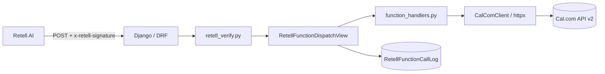

# Scheduler — Retell AI × Cal.com backend

Production-oriented Django **5** + **Django REST Framework** service: a **Retell** webhook for **multi-service** scheduling. Callers identify offerings by stable **`service_key`** values from a **server-side catalog** (mapped to Cal.com `event_type_id` and metadata). Legacy **`event_type_id`** in JSON is still accepted for backward compatibility. A separate **GET** endpoint lists **Cal.com event types** (`GET /v2/event-types` via the server’s API key) for discovery.

**LLM / agent rule:** Prompts should **only** use `service_key` strings from your catalog (or names you document from `GET /api/event-types/`). Agents must **not** invent or repeat raw Cal.com numeric `event_type_id` values — those are configured by operators in `SERVICE_CATALOG` / `SERVICE_CATALOG_JSON`, not by the model.

## Architecture



- **HTTP**: `POST /api/retell/functions/` (CSRF-exempt, Retell webhook), `GET /api/event-types/` (proxies Cal.com, no Retell signature), `GET /health/`.
- **Verification**: Official **`retell-sdk`** `verify(body, api_key, signature)` on the **raw** UTF-8 body (never re-serialize JSON for signing) — only for `/api/retell/functions/`.
- **Cal.com**: `CalComClient` centralizes headers (`Authorization`, `cal-api-version`), timeouts, and limited retries. **Slots**, **event-types**, and **bookings** use **different** `cal-api-version` values per Cal.com docs — see environment variables below.
- **Multi-service catalog**: `SERVICE_CATALOG` in settings (or **`SERVICE_CATALOG_JSON`** env) maps each **`service_key`** → `{ event_type_id, label, description }`. Functions **`check_availability`**, **`book_appointment`**, and **`find_booking`** accept **`service_key`** (preferred) or legacy **`event_type_id`**. **`reschedule_booking`** / **`cancel_booking`** may include optional **`service_key`** for validation and echo in responses.
- **Matching**: `find_booking` uses **email and/or phone** (normalized digits for phone). **Name alone is never sufficient** (see `booking_matcher.py`).
- **Audit**: Each invocation is stored in **`RetellFunctionCallLog`** (payload/response JSON, success flag). **Secrets are not logged.**

## Setup

**Requirements:** Python **3.12+** (3.13 works in CI/local), pip, optional PostgreSQL.

```bash
cd scheduler
python3 -m venv .venv
source .venv/bin/activate   # Windows: .venv\Scripts\activate
pip install -r requirements.txt
cp .env.example .env
# Edit .env — set DJANGO_SECRET_KEY, RETELL_API_KEY, CALCOM_API_KEY
python manage.py migrate
python manage.py runserver 0.0.0.0:8000
```

Create a superuser if you use the admin: `python manage.py createsuperuser`

## Environment variables

| Variable                         | Purpose                                                                                                                                                                     |
| -------------------------------- | --------------------------------------------------------------------------------------------------------------------------------------------------------------------------- |
| `DJANGO_SECRET_KEY`              | Django secret                                                                                                                                                               |
| `DJANGO_DEBUG`                   | `True`/`False`                                                                                                                                                              |
| `DJANGO_ALLOWED_HOSTS`           | Comma-separated hosts                                                                                                                                                       |
| `RETELL_API_KEY`                 | Retell API key (**webhook badge**) for signature verification                                                                                                               |
| `CALCOM_API_KEY`                 | Cal.com bearer token (often `cal_...`)                                                                                                                                      |
| `CALCOM_BOOKINGS_API_VERSION`    | Header for bookings CRUD (default `2026-02-25`)                                                                                                                             |
| `CALCOM_SLOTS_API_VERSION`       | Header for `GET /slots` (default `2024-09-04`)                                                                                                                              |
| `CALCOM_EVENT_TYPES_API_VERSION` | Header for `GET /event-types` (default `2024-06-14`)                                                                                                                        |
| `CALCOM_BASE_URL`                | Default `https://api.cal.com/v2`                                                                                                                                            |
| `CALCOM_REQUEST_TIMEOUT`         | Seconds (default `30`)                                                                                                                                                      |
| `CALCOM_MAX_RETRIES`             | Extra attempts on 5xx / network errors (default `2`)                                                                                                                        |
| `DEFAULT_TIMEZONE`               | Default IANA zone for helpers (e.g. `America/Los_Angeles`)                                                                                                                  |
| `SERVICE_CATALOG_JSON`           | Optional JSON object overriding the built-in service catalog: each key is a `service_key`, each value must include `event_type_id` (and may include `label`, `description`) |
| `DATABASE_URL`                   | Optional `postgresql://...` — if unset, **SQLite** `db.sqlite3` is used                                                                                                     |
| `LOG_LEVEL`                      | e.g. `INFO`                                                                                                                                                                 |

### Built-in example keys (when `SERVICE_CATALOG_JSON` is unset)

Handyman catalog — **only** these keys in the default settings:

| `service_key`     | Default `event_type_id` (placeholder) | Notes                                                            |
| ----------------- | ------------------------------------- | ---------------------------------------------------------------- |
| `repair_request`  | `1`                                   | On-site repair / intake — set real ID via `SERVICE_CATALOG_JSON` |
| `repair_estimate` | `123`                                 | Estimate visit — set real ID via `SERVICE_CATALOG_JSON`          |

Add more keys only by supplying a full **`SERVICE_CATALOG_JSON`** object.

**Retell payloads:** Parameter names may be **camelCase** (`serviceKey`, `timeZone`, `eventTypeId`). For duration, prefer **`lengthInMinutes`** (matches Cal.com booking JSON); **`durationMinutes`** is also accepted. Both map to internal **`duration_minutes`** before validation.

**Duration:** **`duration_minutes`** (optional on `check_availability` / `book_appointment`, optional on `reschedule_booking`) must be one of **`30`, `60`, `90`, `120`, `180`, `240`, `480`**. If omitted, defaults are **`repair_estimate` → 60**, **`repair_request` → 90**, legacy **`event_type_id`-only** availability checks → **60**. Slots use Cal.com query param **`duration`**; bookings use **`lengthInMinutes`**.

**`book_appointment`:** Required **`address`** (job site) is stored in Cal.com **`metadata.address`** (with optional **`metadata.notes`**). Optional **`location`** is a JSON object (e.g. `{"type":"integration","integration":"cal-video"}`) per [create-booking](https://cal.com/docs/api-reference/v2/bookings/create-a-booking). US phone numbers may omit `+1`; the server normalizes to E.164.

**Hyphens vs underscores:** Catalog keys may use **hyphens** (e.g. `repair-estimate` in `SERVICE_CATALOG_JSON`) while your prompt uses **underscores** (`repair_estimate`). The server accepts either if it matches after swapping `-` ↔ `_`, and stores the **canonical catalog key** on success.

**Debugging 400 responses:** Logs include `retell_validation_failed` with an `errors` string. Typical causes: unknown `service_key` (not in your catalog — check `SERVICE_CATALOG_JSON` vs agent prompt), missing `start`/`end`/`time_zone`, or a mismatch between `.env` catalog keys and what the LLM sends.

## Migrations

```bash
python manage.py makemigrations
python manage.py migrate
```

## Retell configuration

1. In the Retell dashboard, add a **custom function** (or tool) that **POSTs** to your public URL, e.g. `https://your-domain.com/api/retell/functions/`.
2. Use the **same** Retell API key that has the **webhook badge** as `RETELL_API_KEY` on the server.
3. Ensure the request body is **JSON** and matches one of the shapes below. Retell must send the **`x-retell-signature`** header (handled automatically when using Retell’s secure webhook integration).

### Request body shapes (both supported)

**Option A**

```json
{
  "name": "check_availability",
  "arguments": { "...": "..." }
}
```

**Option B**

```json
{
  "function_name": "book_appointment",
  "args": { "...": "..." }
}
```

## `curl` examples

All examples assume the dev server is running (`python manage.py runserver`) and use **`BASE`** below. Responses are JSON; pipe with **[`jq`](https://jqlang.github.io/jq/)** for readability.

### Common headers

```bash
export BASE=http://127.0.0.1:8000
export HDR='Content-Type: application/json'
# Optional: pretty-print JSON (install jq)
alias jqcat='jq .'
```

### Health check

```bash
curl -sS -w "\nHTTP %{http_code}\n" "$BASE/health/"
# Expect: body "ok" and HTTP 200
```

### List event types (Cal.com `GET /v2/event-types`)

Uses the server’s **`CALCOM_API_KEY`** — does **not** use Retell signature. Optional query parameters are passed through to Cal.com (see [Cal.com event types API](https://cal.com/docs/api-reference/v2/event-types/get-all-event-types)).

```bash
# All event types for the authenticated user (API key owner)
curl -sS "$BASE/api/event-types/" | jq .

# Example: filter by Cal.com username
curl -sS "$BASE/api/event-types/?username=your-username" | jq .
```

Protect this route in production (firewall, reverse proxy auth, or VPN); it exposes scheduling metadata to anyone who can reach the URL.

### Signed requests (production and realistic local runs)

If `RETELL_API_KEY` is **empty**, verification fails and requests return **401**. With a key set, **`x-retell-signature`** must match the **exact raw body** (see [Retell secure webhook](https://docs.retellai.com/features/secure-webhook)). Plain `curl` without a valid signature therefore gets **401**; use Retell’s dashboard to hit your URL, or rely on this repo’s **tests** (which mock verification). For integration testing, point Retell’s custom function at your tunneled URL (`ngrok`, etc.) so Retell adds the signature automatically.

Example header shape (value must be real):

```bash
# Pseudocode — replace with a real signature from Retell for this exact body string
curl -sS "$BASE/api/retell/functions/" \
  -H "$HDR" \
  -H "x-retell-signature: <paste-signature-here>" \
  -d @payload.json
```

### 1. `check_availability` — preferred: `service_key` (Option A: `name` + `arguments`)

Use a **`service_key`** from your catalog (`repair_request`, `repair_estimate`):

```bash
curl -sS "$BASE/api/retell/functions/" -H "$HDR" -d '{
  "name": "check_availability",
  "arguments": {
    "service_key": "repair_estimate",
    "start": "2026-03-30",
    "end": "2026-04-02",
    "time_zone": "America/Los_Angeles",
    "duration_minutes": 60
  }
}' | jq .
```

**Legacy (still supported):** pass **`event_type_id`** instead of `service_key` if you must support older clients.

**Sample success shape:**

```json
{
  "success": true,
  "available": true,
  "service_key": "repair_estimate",
  "service_label": "Repair estimate",
  "duration_minutes": 60,
  "slots": [{ "start": "2026-03-30T18:00:00Z", "end": "2026-03-30T18:30:00Z" }]
}
```

### 2. `book_appointment` — Option B (`function_name` + `args`) with `service_key`

```bash
curl -sS "$BASE/api/retell/functions/" -H "$HDR" -d '{
  "function_name": "book_appointment",
  "args": {
    "service_key": "repair_request",
    "start": "2026-03-30T18:00:00Z",
    "name": "John Smith",
    "email": "john@example.com",
    "phone": "2065551212",
    "address": "123 Main St, City",
    "time_zone": "America/Los_Angeles",
    "notes": "Gate code 123",
    "duration_minutes": 60,
    "location": { "type": "integration", "integration": "cal-video" }
  }
}' | jq .
```

Omit `duration_minutes` to use service defaults (`repair_estimate` → 60, `repair_request` → 90). Omit **`location`** if the event uses a default. **`notes`** may be omitted or JSON `null`; **`address`** is required.

### 3. `find_booking` — `service_key` + identifiers + date window

```bash
curl -sS "$BASE/api/retell/functions/" -H "$HDR" -d '{
  "name": "find_booking",
  "arguments": {
    "service_key": "repair_estimate",
    "name": "John Smith",
    "email": "john@example.com",
    "phone": "+12065551212",
    "after_start": "2026-03-01T00:00:00Z",
    "before_end": "2026-04-30T23:59:59Z"
  }
}' | jq .
```

Omit `service_key` / `event_type_id` to search across all event types (subject to Cal.com API filters).

**Phone-only** (still requires digits that match Cal.com’s attendee phone):

```bash
curl -sS "$BASE/api/retell/functions/" -H "$HDR" -d '{
  "name": "find_booking",
  "arguments": {
    "phone": "+12065551212",
    "after_start": "2026-03-01T00:00:00Z"
  }
}' | jq .
```

### 4. `reschedule_booking` (optional `service_key`)

```bash
curl -sS "$BASE/api/retell/functions/" -H "$HDR" -d '{
  "name": "reschedule_booking",
  "arguments": {
    "booking_uid": "abc123",
    "service_key": "repair_estimate",
    "new_start": "2026-04-01T19:00:00Z",
    "email": "john@example.com",
    "reason": "User requested reschedule",
    "duration_minutes": 120
  }
}' | jq .
```

Optional **`duration_minutes`** on reschedule sets Cal.com **`lengthInMinutes`** when supported.

### 5. `cancel_booking` (optional `service_key`)

```bash
curl -sS "$BASE/api/retell/functions/" -H "$HDR" -d '{
  "name": "cancel_booking",
  "arguments": {
    "booking_uid": "abc123",
    "service_key": "repair_estimate",
    "reason": "User requested cancellation"
  }
}' | jq .
```

### Errors (structured JSON)

Validation and domain errors return **4xx/5xx** with a body like:

```json
{
  "success": false,
  "error": "Human-readable message",
  "error_code": "validation_error"
}
```

Quick check of HTTP status:

```bash
curl -sS -o /dev/null -w "%{http_code}\n" "$BASE/health/"
```

## Deployment notes

- Run behind **HTTPS** (TLS termination at load balancer or reverse proxy).
- Set `DJANGO_DEBUG=False`, restrict `DJANGO_ALLOWED_HOSTS`, and use a strong `DJANGO_SECRET_KEY`.
- Use **PostgreSQL** in production via `DATABASE_URL`.
- Optionally allowlist Retell’s IP (see [Retell secure webhook docs](https://docs.retellai.com/features/secure-webhook)).
- Collect logs from stdout (JSON-style lines from the configured formatter).

## Security notes

- **Never** log `RETELL_API_KEY`, `CALCOM_API_KEY`, or raw signatures.
- Signature verification depends on the **exact raw body** bytes Retell signed; do not parse-then-re-encode before verifying.
- Use a **webhook-capable** Retell API key only for verification.

## Cal.com assumptions

Endpoints follow public Cal.com v2 docs: `GET /slots` (with `format=range`), `GET /event-types`, `POST/GET /bookings`, `POST /bookings/{uid}/reschedule`, `POST /bookings/{uid}/cancel`. If Cal.com changes response envelopes, adjust parsing in `booking/services/calcom.py` and `function_handlers.py` only.

Request URLs are built with string concatenation (not `urllib.parse.urljoin`) so paths like `/slots` cannot accidentally replace the `/v2` base path.

## Tests

```bash
cd scheduler
python manage.py test booking -v 2
```

Coverage includes:

- `GET /health/` returns `ok`
- `GET /api/event-types/` proxies to Cal.com (mocked in tests)
- **Service catalog**: allowed `service_key` resolution, unknown key rejected, `service_key` overrides legacy `event_type_id`, legacy `event_type_id` alone still works
- `booking.service_catalog` helpers
- Retell signature rejected (401) vs accepted dispatch (200)
- All five functions through `POST /api/retell/functions/` with **Cal.com mocked**
- Option A and Option B request body shapes (`name`/`arguments` vs `function_name`/`args`)
- Serializer validation, invalid JSON, unknown function
- `extract_bookings_list` parsing, booking matcher scoring
- `RetellFunctionCallLog` audit row on success
- `X-Request-ID` response header from correlation middleware

External HTTP (Cal.com) and Retell verification are **mocked** in tests so CI does not need real API keys.

## Optional extensions

- **Idempotency**: pass a client-generated key in JSON and dedupe in cache or DB (not implemented by default).
- **Docker**: add a `Dockerfile` if your platform requires it.
